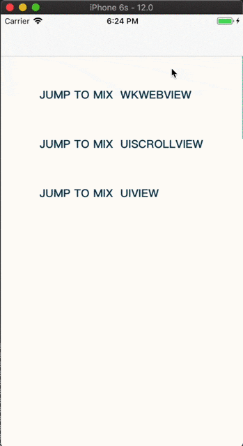
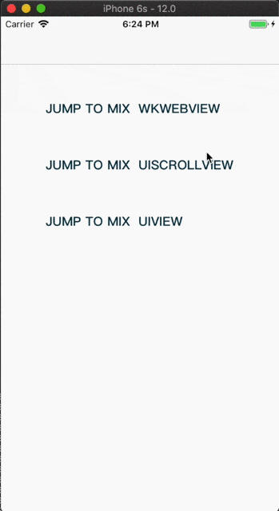
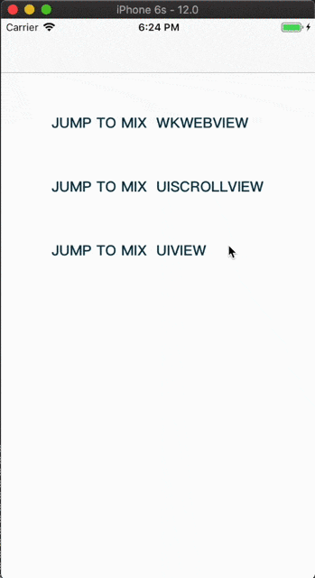

# MXScroll
[](https://cocoapods.org/pods/MXScroll)
[](https://opensource.org/licenses/MIT)
[](https://cocoapods.org/pods/MXScroll)

MXScroll is a framework that lets you create mix scroll view easier. you can just provide the datasource and do not need to consider the page composition. the datasource can be provided by storyboard or programmatically. 

### Structure  


## Example

To run the example project, clone the repo, and run `pod install` from the Example directory first.

| WKWebView | UIScrollView | UIView |
| --- | --- | --- |
|  |  |  |

## Requirements
* Xcode 9+
* Swift 4.0+
* iOS 10.0+ 

## Installation

### Swift compatibility

To work with Swift 4.0 use MXScroll v.0.1.0.

To work with Swift 4.1 use MXScroll v.0.1.2.

### Cocoapods
MXScroll is available through [CocoaPods](https://cocoapods.org). To install
it, simply add the following line to your Podfile:

```ruby
pod 'MXScroll'
```
## Usage
### Simple

##### 1. First you should 
    import MXScroll

##### 2. Prepare Header

```Swift
let header = UIStoryboard(name: "Main", bundle: Bundle.main).instantiateViewController(withIdentifier: "HeaderViewController")
``` 

if `WKWebView` , `UIWebView` or `UIScrollView` is in HeaderVC, you should implement `MXViewControllerViewSource`.

```Swift
extension HeaderViewController:MXViewControllerViewSource{
      func headerViewForContentOb() -> UIView? {
          return webView
      }
}
```

##### 3. Prepare Content

```Swift
let child1 = UIStoryboard(name: "Main", bundle: Bundle.main).instantiateViewController(withIdentifier: "ChildViewController")
```
if `UITableView` or `UIScrollView` is in ContentVC, you should implement `MXViewControllerViewSource`

```Swift
extension ChildViewController:MXViewControllerViewSource{
       func viewForMixToObserveContentOffsetChange() -> UIView {
           return self.tableView
       }
}
```

##### 4. Prepare Segment
You can use the `MSSegmentControl` provide by `MXScroll`

```Swift
  let segment = MSSegmentControl(sectionTitles: ["1", "2"])
```
##### 5. Mix 

```Swift
let header = UIStoryboard(name: "Main", bundle: Bundle.main).instantiateViewController(withIdentifier: "HeaderViewController")
        
let child1 = UIStoryboard(name: "Main", bundle: Bundle.main).instantiateViewController(withIdentifier: "ChildViewController")
        
let child2 = UIStoryboard(name: "Main", bundle: Bundle.main).instantiateViewController(withIdentifier: "SecondViewController")
        
let segment = MSSegmentControl(sectionTitles: ["1", "2"])
        
let mx = MXViewController<MSSegmentControl>.init(headerViewController: header, segmentControllers: [child1, child2], segmentView: segment)
navigationController?.pushViewController(mx, animated: true)
```
### Segment
If you want to use the custom Segment,Just implement`MXSegmentProtocol` 

```Swift
extension MSSegmentControl: MXSegmentProtocol {
    // segment change to tell vc
    public var change: ((Int) -> Void) {
        get {
            return self._didIndexChange
        }
        set {
            self._didIndexChange = newValue
        }
    }
    
    // vc change callback method
    public func setSelected(index: Int, animator: Bool) {
        self.setSelected(forIndex: index, animated: animator, shouldNotify: true)
    }
}
```


## Author

cillyfly, cillyfly@163.com

## License

MXScroll is available under the MIT license. See the LICENSE file for more info.
